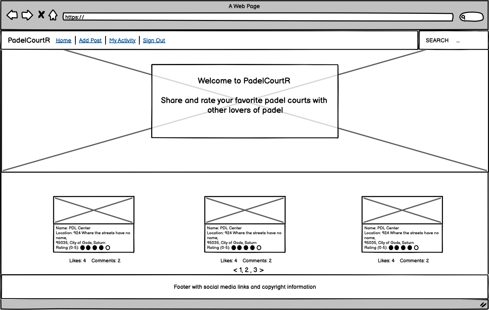

# PadelCourtR


## [Link to live project here](https://padelcourtr.herokuapp.com/)

## Table of Contents
<hr>

### 1. [ Purpose of the project](#1-purpose-of-the-project)

### 2. [ UX](#2-ux)

- ### 2.1[ User Stories](#21-user-stories-1)
- ### 2.2[ Typography and color schema](#22-typography-and-color-schema-1)
- ### 2.3[ Structure](#23-structure-1)

### 3. [ Features](#3-features)

### 4. [ Future features](#4-future-features)

### 5. [ Wireframes](#5-wireframes)

### 6. [ Technology](#6-technology)

### 7. [ Testing](#7-testing)
- ### 7.1[ code validation](#71-code-validation-1)
- ### 7.2[ test cases (user story based with screenshots)](#72-test-cases-user-story-based-with-screenshots-1)
- ### 7.3[ fixed bugs](#73-fixed-bugs-1)
- ### 7.4[ supported screens and browsers](#74-supported-screens-and-browsers-1)

### 8. [ Deployment](#8-deployment)
- ### 8.1[ via Heroku](#81-via-heroku-1)
- ### 8.2[ via GitHub](#82-via-github-1)
- ### 8.3[ via GitPod](#83-via-gitpod-1)

### 9. [ Credits](#9-credits)

## 1. Purpose of the project

I wanted to create a website for something that I love. A sport called Padel. It is one of the fastest growing sports in Sweden and there are opening about 50 to 100 new courts around the country each year. So this website aims to allow users to add padel courts with ratings to either inspire, inform or possibly even warn other users. The community can then search for courts and leave comments wether they agree with the author or not as well as write other helpful information that the author might have missed. Users will then also be able to upvote/downvote the courts.

## 2. UX

- ### 2.1 User stories [(Kanban board can be found here)](https://github.com/pakkONE/Portfolio-Project-4/projects/1) Each user story is a link that takes you to the GitHub issue I have created for each user story
    - Anonymous User
        - [As an **Anonymous User** I can **view blog posts as a list** so that **I can select one to read**](https://github.com/pakkONE/Portfolio-Project-4/issues/1)
        - [As an **Anonymous User** I can **search posts by court name** so that **find posts about courts I'm interested in**](https://github.com/pakkONE/Portfolio-Project-4/issues/9)
        - [As an **Anonymous User** I can **read comments and view likes/dislikes** so that **I can be informed by the content**](https://github.com/pakkONE/Portfolio-Project-4/issues/2)
        - [As an **Anonymous User** I can **read blog posts and see amount of likes/dislieks** so that **I can see which posts are viral**](https://github.com/pakkONE/Portfolio-Project-4/issues/14)
        - [As an **Anonymous User** I can **register an account** so that **I can log in, add posts and comment/like posts**](https://github.com/pakkONE/Portfolio-Project-4/issues/6)
    - Registered User
        - [As a **Registered User** I can **comment on a post** so that **I can engage in the conversation**](https://github.com/pakkONE/Portfolio-Project-4/issues/3)
        - [As a **Registered User** I can **like or unlike a post** so that **I can interact with the content**](https://github.com/pakkONE/Portfolio-Project-4/issues/4)
        - [As a **Registered User** I can **dislike or undislike a post** so that **I can interact with the content**](https://github.com/pakkONE/Portfolio-Project-4/issues/5)
        - [As a **Registered User** I can **see all posts and comments I've made** so that **I can easily modify or remove them if needed**](https://github.com/pakkONE/Portfolio-Project-4/issues/10)
        - [As a **Registered User** I can **delete my posts** so that **wrong, old or irrelevant information doesn't stay visible**](https://github.com/pakkONE/Portfolio-Project-4/issues/11)
        - [As a **Registered User** I can **rate the courts by my experience** so that **other users can be inspired or informed**](https://github.com/pakkONE/Portfolio-Project-4/issues/12)
    - Site Admin
        - [As a **Site Admin** I can **create a draft post** so that **I can finish writing it later**](https://github.com/pakkONE/Portfolio-Project-4/issues/13)
        - [As a **Site Admin** I can **delete posts and comments** so that **I can remove potentially fraudulent or harmful content**](https://github.com/pakkONE/Portfolio-Project-4/issues/8)
        - [As a **Site Admin** I can **approve comments** so that **I can moderate the content in the comments section**](https://github.com/pakkONE/Portfolio-Project-4/issues/7)

- ### 2.2 Typography and color schema

I used [Colormind](http://colormind.io/bootstrap/) to generate a color schema. I decided on two colors to incorporate on my site based on the color on the grass on the best artificial grass for a padel court, called Mondo as well as the color of the padel ball Head Pro S. The details are here beneath. 

- Typography
    - Logo - Anton, Regular, weight: 400
    - The rest - Roboto Condensed, Regular, weight: 300, 400, 700
    - HTML Code:
        - ``` <link rel="preconnect" href="https://fonts.googleapis.com"> ```
        - ``` <link rel="preconnect" href="https://fonts.gstatic.com" crossorigin> ```
        - ``` <link href="https://fonts.googleapis.com/css2?family=Anton&family=Roboto+Condensed:wght@300;400;700&display=swap" rel="stylesheet"> ```
    - CSS Code:
        - ``` font-family: 'Anton', sans-serif; ```
        - ``` font-family: 'Roboto Condensed', sans-serif; ```
- Color Schema
    - Blue Aritifical Grass color of padel courts called Mondo - #005387
        - Used as background color for navbar, hover effects over some buttons
    - Head Pro S Padel ball - #e2f754
        - Used as font color on logo and hamburger menu icon on mobile devices

- ### 2.3 Structure of Data

- I used [smartdraw](https://www.smartdraw.com/) for creating the structure of the models. I have included screenshots of it below:
    - 

## 3. Features
- Navigation Bar
    - Navigation bar has different links dependant on wether the user is logged in or not
        - Home, Sign up/Log in if you are logged out
        - Home, Add Post, My Activity, Log out if you are logged in
        - Search bar with a function to search posts based on court name. Is not case-sensitive.
- Home/Blog view section
    - Hero image is displayed at the top of this page, with a call-to-action button for users who are not logged in.
    - This section lists blog posts by the latest created_on date, also displaying likes/dislikes and number of comments
    - It lists them as cards and when you click on the header of the cards it will open that blog post in full width page and where you can commment on the post/like or dislike the court
    - They are paginated by 9 posts per page, three cards per row.
- Blog post view
    - Here is a page for each post that display relevant information about the court as well as the content written by the user.
    - There is also a comment section for registered users to comment on the post.
    - Registered users can also upvote/downvote posts.
    - The author of the post will also have two buttons at the bottom of the blog post, one for editing the post and another for deleting the post
- Add Post section (only for regiestered users)
    - Here is a django form with the ability to add a new post for users who are signed in.
    - The image file is optional and if uploaded will be stored on cloudinary. If user does not provide one a placeholder photo will be used.
- Edit Post
    - Users who have added posts has the ability to edit their posts.
- My Activity (only for regiestered users)
    - Here the users comments and posts will be ordered with a link to each post for editing or deleting, as well as for each comment a link to delete the comment
- Confirm delete page
    - Whenever a user clicks on a 'delete post'-button they will be directed to a page asking for their confirmation if they really want to delete the post, with an additional option of going back to the post if they changed their mind.
- Footer
    - This section displays copyright information and links to social media accounts.
- Sign up page
    - Anonymous users has the ability to sing up for an account so that they can add posts, comment on posts and like/dislike posts.
- Sign in page
    - Users who has an account has the ability to sign in to their account.
- Admin section
    - This is only for the site admin but it will be the standard django admin page where the admin can approve posts and comments and handle registered users.

## 4. Future features

- Navigation Bar
    - I'd like to add more links on the site, like a site to donate, and an About section.
- Blog section
    - I'd like to incorporate Google Maps API for allowing user to start typing the adress and then getting suggestions by Google Maps.
    - Each blog post would also have a small window of the map locating the court with an arrow.
- Footer
    - The footer will have a FAQ link added in the future.
- Sign in / Sign up page
    - In the future I will style the forms more to go with the same look as the rest of the page.

## 5. Wireframes

- Home page (logged in)
    - 
- Home page (logged out)
    - 
- Blog post view (logged in)
    - 
- Blog post view (logged out)
    - 

## 6. Technology

- HTML/CSS
    - I used semantic HTML language for the templates
    - Some custom CSS was also done eventhough I used Bootstrap
- JavaScript
    - Some JavaScript was necessary, for Bootstrap as well as eventlistener
- Bootstrap 5.1.3
    - I used Bootstrap for the styling of the webpage and took some inspiration from [this bootstrap blog theme](https://startbootstrap.com/theme/clean-blog)
- Python
    - All additional libraries can be viewed on the [requirements.txt-file](requirements.txt)
- Django
    - Django was the framework used for this project
- Heroku
    - The live project is deployed to [Heroku](https://www.heroku.com/)
- Heroku PostgreSQL
    - To handle the database I used PostgreSQL on Heroku
- Cloudinary
    - As done in the walkthrough project, I also used Cloudinary for storing my static files so that I would not have to rely on Herokus Dynos
- Crispy Forms
    - I also used Crispy forms for the comment form
- FontAwesome
    - My website would not be as cool without the use of FontAwesome and their icons

## 7. Testing

- ### 7.1 code validation
    - HTML
        - HTML code was validated without issues on [W3C HTML Validator](https://validator.w3.org/)
    - CSS
        - CSS code validated without issues on [W3C CSS Validator](https://jigsaw.w3.org/css-validator/validator)
    - Python
        - All Python code was checked with this [PEP8 validator](http://pep8online.com/)
    - JavaScript
        - The JavaScript code had no errors according to [JSHint](https://jshint.com/)
    - Lighthouse
        - All fields were green on Lighthouse

- ### 7.2 test cases of user stories
    - Anonymous User
        - [As an **Anonymous User** I can **view blog posts as a list** so that **I can select one to read**](https://github.com/pakkONE/Portfolio-Project-4/issues/1)
            - The Home page, or index page, is the blog posts view as a list. Paginated by 9 posts and automatically creates pagination at the bottom of the page.
            - The function therefore works as intended.
        - [As an **Anonymous User** I can **search posts by court name** so that **find posts about courts I'm interested in**](https://github.com/pakkONE/Portfolio-Project-4/issues/9)
            - The search function works as intended. It is not case sensitive which is great, as it would otherwise be bad user experience to have to know if e.g. each letter in the court name is captialized or just the first one.
            - The function therefore works as intended.
        - [As an **Anonymous User** I can **read comments and view likes/dislikes** so that **I can be informed by the content**](https://github.com/pakkONE/Portfolio-Project-4/issues/2)
            - Each post displays both the amount of comments and likes/dislikes as intended.
            - Each post that has comments are visible to all users.
            - The function therefore works as intended.
        - [As an **Anonymous User** I can **read blog posts and see amount of likes/dislieks** so that **I can see which posts are viral**](https://github.com/pakkONE/Portfolio-Project-4/issues/14)
            - In the Home view, each post displays both the amount of comments and likes/dislikes as intended so the user can easily identify which one is viral.
            - The function therefore works as intended.
        - [As an **Anonymous User** I can **register an account** so that **I can log in, add posts and comment/like posts**](https://github.com/pakkONE/Portfolio-Project-4/issues/6)
            - There are multiple instances of where the user has a call to action to sign up or log in with their account.
            - The signup process works as intended.
    - Registered User
        - [As a **Registered User** I can **comment on a post** so that **I can engage in the conversation**](https://github.com/pakkONE/Portfolio-Project-4/issues/3)
            - Each comment has to be approved by admin.
            - The comment section works as intended.
        - [As a **Registered User** I can **like or unlike a post** so that **I can interact with the content**](https://github.com/pakkONE/Portfolio-Project-4/issues/4)
            - The like function works as once the user clicks on the like button it will add to the count as well as changing the icon to a solid one.
            - The user can then click on it again if they would like to remove their like and then the count decreases and the icon changes to a regular icon.
            - The function therefore works as intended.
        - [As a **Registered User** I can **dislike or undislike a post** so that **I can interact with the content**](https://github.com/pakkONE/Portfolio-Project-4/issues/5)
            - The dislike function works as once the user clicks on the dislike button it will add to the count as well as changing the icon to a solid one.
            - The user can then click on it again if they would like to remove their dislike and then the count decreases and the icon changes to a regular icon.
            - The function therefore work as intended.
        - [As a **Registered User** I can **see all posts and comments I've made** so that **I can easily modify or remove them if needed**](https://github.com/pakkONE/Portfolio-Project-4/issues/10)
            - Once the user is signed in, the navbar displays a 'my activity' bar where the user can see all their posts and comments with links to either edit/delete the post or a link to delete their comment.
            - They all work as intended.
        - [As a **Registered User** I can **delete my posts** so that **wrong, old or irrelevant information doesn't stay visible**](https://github.com/pakkONE/Portfolio-Project-4/issues/11)
            - Each author of the blog can either see their posts under the 'my acitivity' tab or if they browse to any of their post, the author will then see buttons to edit or delete the post at the bottom of the page.
            - These buttons work as intended.
        - [As a **Registered User** I can **rate the courts by my experience** so that **other users can be inspired or informed**](https://github.com/pakkONE/Portfolio-Project-4/issues/12)
            - When a user is filling out the form to add a new post, there is an option to rate the court from 0-5.
            - This function works as intended.
    - Site Admin
        - [As a **Site Admin** I can **create a draft post** so that **I can finish writing it later**](https://github.com/pakkONE/Portfolio-Project-4/issues/13)
            - Each post created will by default be a draft post until the post is approved by an admin.
            - The function to use draft therefore works as intended.
        - [As a **Site Admin** I can **delete posts and comments** so that **I can remove potentially fraudulent or harmful content**](https://github.com/pakkONE/Portfolio-Project-4/issues/8)
            - In the admin panel there's a possibility to delete each post or comment as needed.
            - The function therefore works as intended.
        - [As a **Site Admin** I can **approve comments** so that **I can moderate the content in the comments section**](https://github.com/pakkONE/Portfolio-Project-4/issues/7)
            - Each comment submitted by users need approval from an admin.
            - The function therefore works as intended.

- ### 7.3 fixed bugs
    - I encountered a bug saying ``` NoReverseMatch at /admin/blog/post/add/ ```<br>
    ``` Reverse for 'django_summernote-upload_attachment' not found. 'django_summernote-upload_attachment' is not a valid view function or pattern name. ```
        - I solved this by adding ``` path('summernote/', include('django_summernote.urls')), ``` to padelcourtr/urls.py instead of blog/urls.py
    - When I am trying to dislike a post and clicking the thumbs down icon, it adds a number to the liked count.
        - This was solved by changing the name of the button from ``` name="bloglike_id" ``` to ``` name="blogdislike_id" ```
    - While logged in and viewing the 'my acitivity' template, there are two separate submit buttons, one for submitting a comment and the other for wanting to delete your comment. The form on the right hand side wouldn't allow me to delete my comment before I filled in the submit comment form as it can't be left blank.
        - To solve this I had to create an eventlistener via JavaScript to prevent default on the delete comment button
    - 
- ### 7.4 supported screens and browsers
    - I have tested this on Safari, Chrome and Brave as well as Safari on iOS.
    - The site works well with responsive design and looks incredible also on smaller screen devices.

- ### 7.5 Manual Testing
    - #### Navigation Bar
        - Navigation Bar
            - Expected Outcome: The navigation bar should be visible on each page of the site. The nav bar should have responsive design with a hamburger menu icon on mobile screens
            - Test: I clicked through each link on the page and the navbar was showing as intended. 
            - Result: The navigation bar is visible on every page of the site and each link worked as expected. On mobile screens the hamburger icon appeared as intended and each link worked as expected.

        - Logo
            - Expected Outcome: When clicking the Logo, the user should be redirected to the home page that lists all the blog posts as a list.
            - Test: I clicked on the logo from each page on the site, both as a logged in user and an anonymous user.
            - Result: Whenever  I clicked the logo I was redirected to home page.

        - Home page
            - Expected Outcome: When clicking on Home link, the user should be redirected to home page that lists all the blog posts as a list.
            - Test: I tried clicking the Home link from all different pages on the site, both as logged in user and not.
            - Result: Each time the link ‘Home’ was clicked, I got redirected to the home page.

        - Add Post page
            - Expected Outcome: The link should not be visible to an anonymous user, which was the intention. Once a user is logged in the link should appear and direct user to a form. Each field should work as intended, with ability to upload image as well as rate the court.
            - Test: I verified that as an anonymous user I could not see the link in the navbar. Once I logged in it appeared. I then tried uploading an image as well as not uploading one. Then the form should assign a placeholder photo.
            - Result: The Add Post form was only visible as a signed in user. If a field was not filled out correctly it failed loudly to the user and was prompted to change the input to the field to a required type. A placeholder image was assigned when no image was uploaded. The image submitted also uploaded correctly and the post displayed the uploaded image and not the placeholder image.

        - My Activity page
            - Expected Outcome: When logged in, each user should have a nav link to a view displaying all posts and comments the user has made with links to edit/delete the post or link to delete the comment.
            - Test: I tried to access the link as an anonymous user but it wasn’t visible. I then tried to log in and see if I could access the view. Once the view was displayed I then tried each button to edit/delete to see that it was the correct post it wanted to edit/delete.
            - Result: The link was not visible as an anonymous user. Once logged in the link appeared and directed me to the expected view. Each post and comment that I was the author of was listed and the buttons to edit/delete worked as intended.

        - Sign up page
            - Expected Outcome: For an anonymous user the navbar should display a sign up link and then disappear once logged in.
            - Test: I tried to access the link as logged in user but it wasn’t visible. I then tried to log out and see if I could access the view, which I did. I then tried to click the link.
            - Result: The link was only visible once not logged in and when clicked it directed me to the sign up form.

        - Login Link
            - Expected Outcome: For an anonymous user the navbar should display a link to log in and then disappear once logged in.
            - Test: I tried to access the link as logged in user but it wasn’t visible. I then tried to log out and see if I could access the view, which I did. I then tried to click the link.
            - Result: The link was only visible once not logged in and when clicked it directed me to the log in page.

        - Logout Link
            - Expected Outcome: For a logged in user the navbar should display a link to log out and then disappear once logged out.
            - Test: I visited the page as an anonymous user and the link was not visible. Once logged in it appeared and I then tried to click it.
            - Result: The link was only visible once logged in and when clicked it directed me to a page asking if I’m sure I want to log out, as intended.


    - #### Hero Image

        - Hero Image
            - Expected Outcome: The hero image should display a nice photo with text explaining the purpose of the site. If the user is anonymous there should also be displayed a call to action button urging the user to sign up for an account.
            - Test: I visited the page as an anonymous user as well as logged in user. 
            - Result: The image rendered as intended and the explanation of the site was displayed. When loading the page as an anonymous user the Call to action button was visible to sign up page. When I logged in the call to action button disappeared but hero image stayed as intended.


    - #### Blog Post List

        - Blog posts as a list
            - Expected Outcome: The Home page or blog post as a list view should display all the approved posts in cards, three per row and up to three columns per page. 
            - Test: I tested to access this view by either clicking on the logo or the Home link in the navbar. 
            - Result: The view displays blog posts as a list with three posts per row and with three columns. 

        - Pagination
            - Expected Outcome: After 9 posts the page should paginate and automatically display the pagination buttons at the bottom.
            - Test: I created more than 9 posts to see if the site pagination worked.
            - Result: The pagination appeared at the bottom as expected once the posts amount was more than 9.


    - #### Blog Post View

        - Blog Post View
            - Expected Outcome: When clicking on any of the blog posts in the blog posts list, the user should be directed to a page displaying the specific blog post in detail. The post view should also display the amount of comments, likes and dislikes.
            - Test: I tested clicking on each card to see that it directed me to the correct blog post. I tried commenting on each post as well as like/dislike the posts.
            - Result: The links work and directs the user to the correct post. The function to like/dislike a post also works and increases/decreases the count as expected. The icons also changes depending on if the user has liked/disliked the post or not.

        - Likes
            - Expected Outcome: Each registered user should be able to like each post and also unlike.
            - Test: I tried liking a post as an anonymous user but it didn’t work. Once logged in it worked. When clicking it again it removed the like.
            - Result: Works as expected

        - Dislikes
            - Expected Outcome: Each registered user should be able to dislike each post and also undislike.
            - Test: I tried disliking a post as an anonymous user but it didn’t work. Once logged in it worked. When clicking it again it removed the dislike
            - Result: Works as expected

        - Comments
            - Expected Outcome: Each registered user should be able to comment on each post.
            - Test: I tested with different users to comment on different posts.
            - Result: It worked as intended.

        - Counter
            - Expected Outcome: For likes, dislikes and comments each post should display the counter for each function.
            - Test: I tested commenting, liking and disliking posts and then removing each to see if the counter stayed up to date.
            - Result: The counter worked for each function and increased/decreased was intended.

        - Icons
            - Expected Outcome: The icons should display differently dependant on if the user is logged in or not, and then change yet again when liked/disliked
            - Test: I viewed the icons as an anonymous user, and then as a logged in user, and then again as I had liked/disliked the posts
            - Result: The icons were displayed with “text-secondary” bootstrap class for an anonymous user and then as a regular font awesome icon for logged in user. Once clicked and liked/disliked the icon then changed to a solid font awesome icon.

        - Delete Comments
            - Expected Outcome: When viewing a post, if the user has commented on the post it should display a delete comment button underneath the comment that the user can click to delete the comment.
            - Test: I viewed posts that I had not commented on as well as posts that I had commented on. If button was visible I then tried clicking it.
            - Result: The delete comment button was only displayed on the comments I had made. And when the button was clicked, the comment was deleted.

        - Edit Post
            - Expected Outcome: The author of the post should see the ability to edit their post at the bottom of the page.
            - Test: I viewed posts that I had not authored as well as posts I was the author of.
            - Result: The edit post button was only visible on the posts I was the author of.

        - Delete Post
            - Expected Outcome: The author of the post should see the ability to delete their post at the bottom of the page.
            - Test: I viewed posts that I had not authored as well as posts I was the author of.
            - Result: The delete post button was only visible on the posts I was the author of.

        - Confirm Delete Post Page
            - Expected Outcome: When a user clicks on delete post button it should direct the user to a confirmation page asking the user to confirm that they actually want to delete to said post.
            - Test: I tested clicking the button on several different posts.
            - Result: Each time the delete button directed me to the confirmation page for the correct post.


    - #### Add Post

        - Form
            - Expected Outcome: The form should allow the user to add a post, with uploaded image and rating the court. The form should also validate the input from the user and let the user know if something is invalid. In case of error the form should then stay populated with the fields and let the user change only the invalid part.
            - Test: I tested filling out the form with all kinds of errors and finally submit a valid form. 
            - Result: The error messages displayed correctly and when the form was valid it was successfully submitted.


    - #### My Activity

        - Posts
            - Expected Outcome: This view should list all the posts the user is the author of with buttons to either edit or delete the post.
            - Test: I tested viewing this page for different users and clicking the buttons to see if they directed me to the correct posts.
            - Result: This view worked as intended and displayed only the posts the specific user was author of. The edit and delete buttons also worked as intended for each post.

        - Comments
            - Expected Outcome: This view should list all the comments the user is the author of with button to delete each comment.
            - Test: I tested viewing this page for different users and clicking the button to see if it deleted the correct comment.
            - Result: This view worked as intended and displayed only the comments the specific user was author of. The delete button also worked as intended for each comment.

    - #### Footer

        - Footer
            - Expected Outcome: The footer should be visible on all pages of the site and always be placed on the bottom of the page.
            - Test: Visit every page of the site to check if footer is visible.
            - Result: The footer is visible on every page of the site.

        - Footer Links
            - Expected Outcome: The icons for social media in the footer are supposed to be opened up in new tabs when clicked.
            - Test: Click the social media icons in footer.
            - Result: When clicking the icons the social media is opened up in a new tab.


    - #### Account Section

        - Register new acocunt
            - Expected Outcome: As an anonymous user you should be able to create an account to be able to add posts, comment and like/dislike posts.
            - Test: Create new account with unique username as well as create new account with already existing username.
            - Result: The sign up form works as intended. You can’t create an account with a username that already exists.

        - Login
            - Expected Outcome: The user should be able to log in to their account.
            - Test: Log in with correct username but wrong password, wrong username and correct password as well as correct username and correct password.
            - Result: The user cannot log in with either incorrect username or password. Both fields have to be correct to correctly work.

        - Log out
            - Expected Outcome: The user should be able to log out.
            - Test: I tested the sign out function.
            - Result: It worked as expected. I could log in to another account after signing out.


## 8. Deployment

- ### 8.1 via Heroku
    - To deploy this page to Heroku from its GitHub repository, the following steps were taken:

        1. Create the Heroku App:
            - Select "Create new app" in Heroku.
            - Choose a name for your app and select the location.

        2. Attach the Postgres database:
            - In the Resources tab, under add-ons, type in Postgres and select the Heroku Postgres option.

        3. Prepare the environment and settings.py file:
            - In the Settings tab, click on Reveal Config Vars and copy the url next to DATABASE_URL.
            - In your GitPod workspace, create an env.py file in the main directory. 
            - Add the DATABASE_URL value and your chosen SECRET_KEY value to the env.py file.
            - Add the SECRET_KEY value to the Config Vars in Heroku.
            - Update the settings.py file to import the env file and add the SECRETKEY and DATABASE_URL file paths.
            - Update the Config Vars with the Cloudinary url, adding into the settings.py file also.
            - In settings.py add the following sections:
                - Cloudinary to the INSTALLED_APPS list
                - STATICFILE_STORAGE
                - STATICFILES_DIRS
                - STATIC_ROOT
                - MEDIA_URL
                - DEFAULT_FILE_STORAGE
                - TEMPLATES_DIR
                - Update DIRS in TEMPLATES with TEMPLATES_DIR
                - Update ALLOWED_HOSTS with ['app_name.heroku.com', 'localhost']

        4. Store Static and Media files in Cloudinary and Deploy to Heroku:
            - Create three directories in the main directory; media, static and templates.
            - Create a file named "Procfile" in the main directory and add the following:
                - web: gunicorn project-name.wsgi
            - Log in to Heroku using the terminal heroku login -i.
            - Then run the following command: **heroku git:remote -a portfolio-project-4**. This will link the app to the Gitpod terminal.
            - After linking your app to your workspace, you can then deploy new versions of the app by running the command **git push heroku main** and your app will be deployed to Heroku.
        5. Link to live project can be found here: [https://padelcourtr.herokuapp.com/](https://padelcourtr.herokuapp.com/)

- ### 8.3 via Gitpod
    - GitPod was used as the environment for development. These are the steps to set it up.
        - I used Code Institute GitPod template (https://github.com/Code-Institute-Org/gitpod-full-template)
        - Click Use this template.
        - GitPod will now set up the environment for you with all addons/shortcuts needed.

## 9. Credits

 - Default image - [Tomasz Krawczyk](https://unsplash.com/photos/M2x3A8Q4JbY?utm_source=unsplash&utm_medium=referral&utm_content=creditShareLink)
 - Color schema thanks to [Colormind](http://colormind.io/bootstrap/)
 - ERDiagram via [smartdraw](https://www.smartdraw.com/)
 - As one of the walkthrough projects also used, I used a [blog theme](https://startbootstrap.com/theme/clean-blog) from startbootstrap.com
 - I'd like to thank my mentor, Rohit, for providing me with helpful ideas and great support throughout the course of this project.
 - The walkthrough projects of this program has also provided me with tips, helpful tools and inspiration to take my projects to the next level.
 - The Tutor Support Team at Code Institute has been very helpful in solving some issues and providing me with knowledge as well as resources for further reading.
 - I have also gained some great tips and ideas from my fellow students at Code Institute. The community is truly amazing and has both inspired and challenged me.